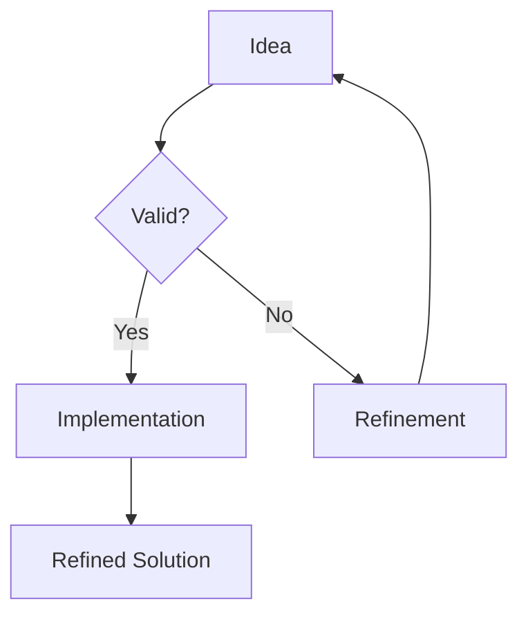

# Advanced Markdown Support

This blog is now equipped with powerful rendering tools for technical writing.

## Mathematics with KaTeX

You can now express complex ideas with LaTeX formulas.

**Inline math**: The fundamental relation of special relativity is $E = mc^2$.

**Block math**:
$$
f(x) = \int_{-\infty}^\infty \hat{f}(\xi) e^{2\pi i \xi x} \, d\xi
$$

## Flowcharts with Mermaid

Visualize your architecture or logic directly in Markdown:



## Elegant Code Snippets

TypeScript support out of the box with JetBrains Mono:

```typescript
interface Developer {
  name: string;
  role: string;
  isGeek: boolean;
}

const me: Developer = {
  name: "OSpoon",
  role: "Digital Architect",
  isGeek: true
};
```

> "Design is not just what it looks like and feels like. Design is how it works." — Steve Jobs
